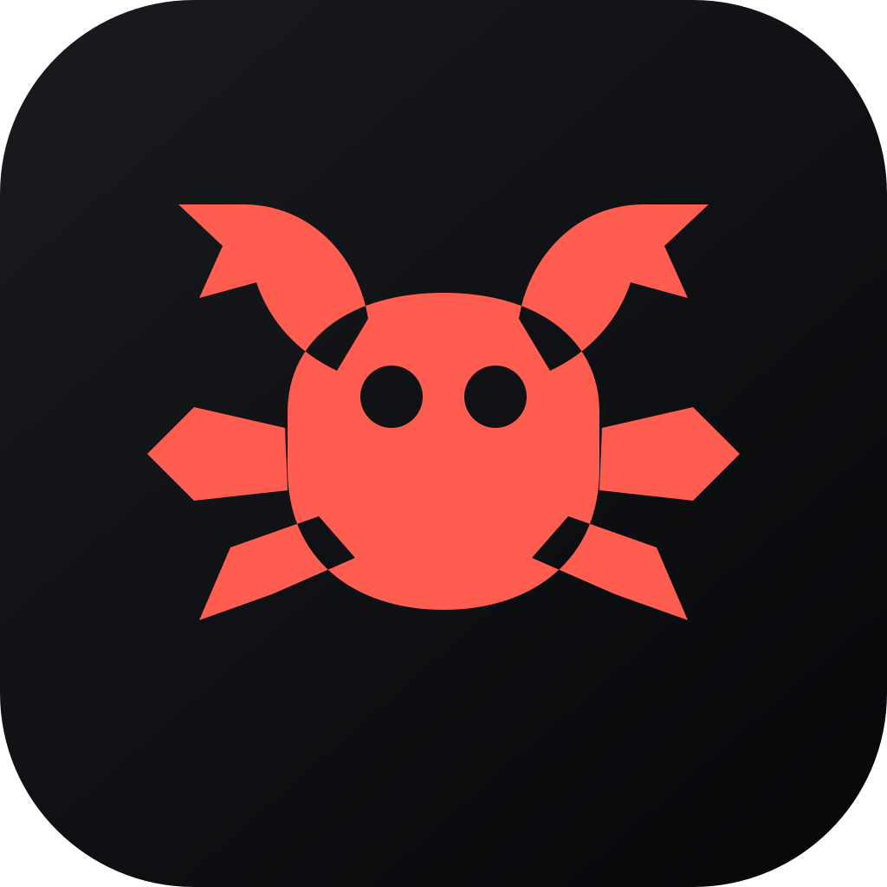

<p align="center">
  
</p>

# Crab

Crab is the native control surface for Crab v2. It provides the web, desktop, and mobile views of a
live agent while Crab owns the durable harness, ACP routing, tools, sessions, memory, triggers, and
bridges on the host machine.

This repository is named `crab-ui`. It is our fork of
[T3 Code](https://github.com/pingdotgg/t3code), whose client/server foundation lets us keep a
high-quality agent UI while focusing Crab itself on orchestration.

```text
Browser
  │
  │ HTTPS (UI traffic only)
  ▼
Dropcliffs reverse proxy
  │
  ▼
Crab UI on Jim's laptop
  │ ACP
  ▼
Crab v2 ──► agent harness ──► model
  │
  └──── durable state · memory · tools · triggers · bridges
```

Dropcliffs only forwards the loopback UI. Crab, the ACP harness, model processes, credentials,
workspace, and state all remain on Jim's laptop.

## Development

Requirements: Node.js 24.13.1+ and [Vite+](https://viteplus.dev/guide/).

```bash
vp i
vp run dev
```

Run focused checks for the surface you changed. See [AGENTS.md](./AGENTS.md) for repository rules
and [docs/](./docs) for the inherited product architecture.

## Brand and compatibility

The shipped product name is **Crab**. Logos and generated platform icons live under
[`assets/`](./assets).

Some upstream identifiers intentionally remain unchanged because existing installs and integrations
depend on them:

| Keep                              | Why                                       |
| --------------------------------- | ----------------------------------------- |
| `@t3tools/*` package names        | workspace and dependency compatibility    |
| `t3`, `t3code://`, and `T3CODE_*` | CLI, deep-link, and environment contracts |
| `~/.t3` and `t3code` state paths  | existing user data and migration safety   |
| T3 Connect                        | optional upstream relay service           |

Those are implementation details, not the public product brand. New user-facing copy must say
Crab.

## Upstream

The `upstream` remote tracks [`pingdotgg/t3code`](https://github.com/pingdotgg/t3code). Keep fork
branding intact when syncing upstream. T3 Code's original license remains authoritative for the
inherited code.
